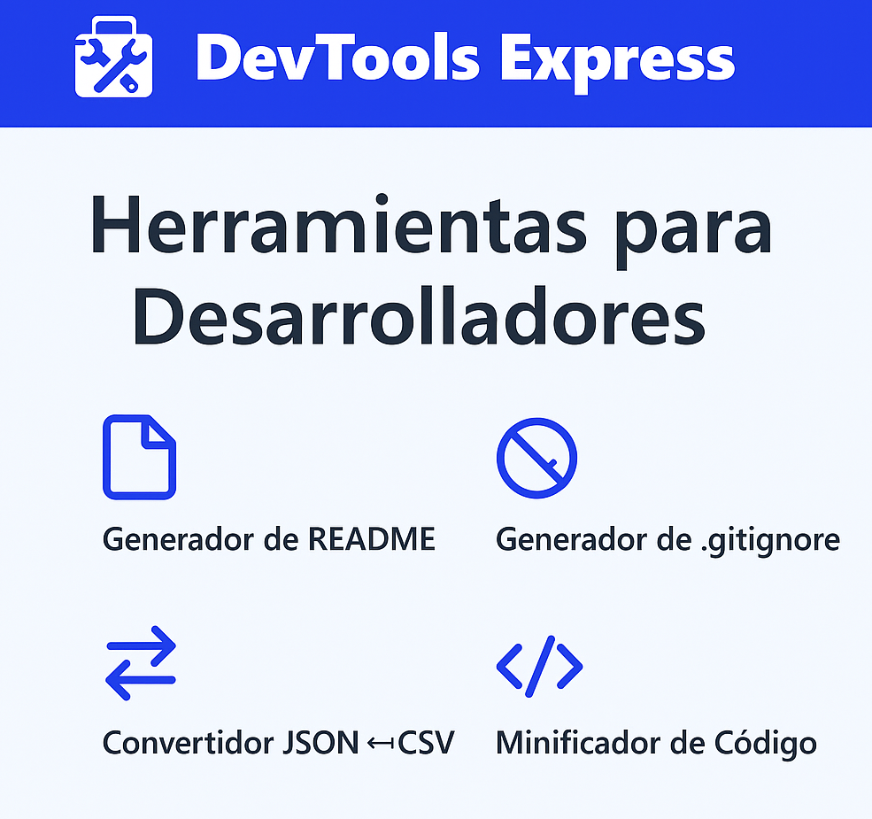

# 🚀 DevTools Express

> Una suite web de herramientas esenciales para desarrolladores modernos. Rápido, modular y en constante expansión.



---

## 🛠️ ¿Qué es DevTools Express?

**DevTools Express** es una aplicación web con un conjunto de utilidades pensadas para facilitar el día a día de cualquier desarrollador. Todo accesible desde un único panel, sin necesidad de instalar nada.

---

## ⚙️ Funcionalidades principales

- ✅ Generador de archivos `README.md` con estructura profesional.
- ✅ Conversor JSON ↔ CSV fácil de usar.
- ✅ Minificador de código HTML, CSS y JS.
- ✅ Generador de comandos Git habituales.
- ✅ Editor de snippets con búsqueda y filtrado.
- ✅ Exportación e importación de configuraciones `.json`.
- ✅ Ayuda contextual integrada por herramienta.
- ✅ Interfaz adaptable y accesible (modo oscuro próximamente).

---

## 🧪 Stack tecnológico

- ⚛️ **React + Vite**
- 🎨 **Tailwind CSS + ShadCN UI**
- 🧠 **React Router, Zustand**
- 📦 **pnpm**
- 📊 **Recharts**
- 🌐 **SEO optimizado**
- 🚀 Preparado para despliegue en Vercel o Netlify

---

## 📁 Estructura del proyecto

devtools-express/
├── public/
│ └── og-image.png
├── src/
│ ├── components/
│ ├── tools/
│ ├── utils/
│ └── App.jsx
├── index.html
└── vite.config.js

---

## 🚀 Cómo usar

```bash
# Clona el proyecto
git clone https://github.com/dominguezz05/devtools-express.git
cd devtools-express

# Instala dependencias
pnpm install

# Inicia el proyecto en local
pnpm dev
```

---

## 🛡️ Licencia
Este proyecto está licenciado bajo la MIT License. Puedes usarlo, modificarlo y distribuirlo libremente. Ver el archivo LICENSE para más detalles.

---

## 🙌 Autor
Desarrollado con pasión por Iker Domínguez

---

## ⭐ ¿Te gusta el proyecto?
Ayúdame con una ⭐ en GitHub o comparte esta herramienta con otros desarrolladores. ¡Gracias!
